# BotArmy SDLC Process Flow

## Overview

The BotArmy SDLC (Software Development Lifecycle) process orchestrates 5 specialized AI agents through a sequential workflow with mandatory execution planning at each stage.

## Process Flow Diagram


## Stage-by-Stage Breakdown

### Stage 1: Analysis 🔍

**Objective**: Transform project brief into structured requirements

```mermaid
flowchart LR
    A1[Project Brief] --> A2[Analysis Execution Plan]
    A2 --> A3[Requirements Document]
    
    A2 -.-> A4[Strategic Planning:<br/>• Analysis objectives<br/>• Step-by-step methodology<br/>• Key focus areas<br/>• Success criteria]
    A3 -.-> A5[Requirements Output:<br/>• Executive Summary<br/>• User Stories<br/>• Functional Requirements<br/>• Non-Functional Requirements]
    
    classDef input fill:#e3f2fd,stroke:#1976d2,stroke-width:2px
    classDef plan fill:#f3e5f5,stroke:#7b1fa2,stroke-width:2px
    classDef output fill:#e8f5e8,stroke:#388e3c,stroke-width:2px
    classDef detail fill:#fff8e1,stroke:#f57c00,stroke-width:1px
    
    class A1 input
    class A2 plan
    class A3 output
    class A4,A5 detail
```



**Agent**: Analyst  
**Duration**: 4-8 minutes  
**Artifacts Created**: `analysis_execution_plan.md`, `requirements.md`

### Stage 2: Design 🏗️

**Objective**: Transform requirements into technical architecture

```mermaid
flowchart LR
    B1[Requirements Document] --> B2[Design Execution Plan]
    B2 --> B3[Architecture Document]
    
    B2 -.-> B4[Design Strategy:<br/>• Design methodology<br/>• Technology selection<br/>• System components<br/>• Quality standards]
    B3 -.-> B5[Architecture Output:<br/>• Technology Stack<br/>• System Components<br/>• Data Model<br/>• API Endpoints<br/>• Security Considerations]
    
    classDef input fill:#e3f2fd,stroke:#1976d2,stroke-width:2px
    classDef plan fill:#f3e5f5,stroke:#7b1fa2,stroke-width:2px
    classDef output fill:#e8f5e8,stroke:#388e3c,stroke-width:2px
    classDef detail fill:#fff8e1,stroke:#f57c00,stroke-width:1px
    
    class B1 input
    class B2 plan
    class B3 output
    class B4,B5 detail
```



**Agent**: Architect  
**Duration**: 4-6 minutes  
**Artifacts Created**: `design_execution_plan.md`, `architecture.md`

### Stage 3: Build 🛠️

**Objective**: Create actionable implementation plans

```mermaid
flowchart LR
    C1[Architecture Document] --> C2[Build Execution Plan]
    C2 --> C3[Implementation Plan]
    
    C2 -.-> C4[Development Strategy:<br/>• Implementation scope<br/>• Development methodology<br/>• Technical standards<br/>• Quality requirements]
    C3 -.-> C5[Implementation Output:<br/>• Step-by-step approach<br/>• Key Components<br/>• Code Examples<br/>• Development Notes]
    
    classDef input fill:#e3f2fd,stroke:#1976d2,stroke-width:2px
    classDef plan fill:#f3e5f5,stroke:#7b1fa2,stroke-width:2px
    classDef output fill:#e8f5e8,stroke:#388e3c,stroke-width:2px
    classDef detail fill:#fff8e1,stroke:#f57c00,stroke-width:1px
    
    class C1 input
    class C2 plan
    class C3 output
    class C4,C5 detail
```



**Agent**: Developer  
**Duration**: 3-5 minutes  
**Artifacts Created**: `build_execution_plan.md`, `implementation_plan.md`

### Stage 4: Validate ✅

**Objective**: Develop comprehensive testing strategies

```mermaid
flowchart LR
    D1[Implementation Plan] --> D2[Validation Execution Plan]
    D2 --> D3[Test Plan]
    
    D2 -.-> D4[Testing Strategy:<br/>• Testing methodology<br/>• Quality assurance<br/>• Testing phases<br/>• Success metrics]
    D3 -.-> D5[Test Plan Output:<br/>• Testing Strategy<br/>• Test Cases<br/>• Test Data<br/>• Quality Metrics]
    
    classDef input fill:#e3f2fd,stroke:#1976d2,stroke-width:2px
    classDef plan fill:#f3e5f5,stroke:#7b1fa2,stroke-width:2px
    classDef output fill:#e8f5e8,stroke:#388e3c,stroke-width:2px
    classDef detail fill:#fff8e1,stroke:#f57c00,stroke-width:1px
    
    class D1 input
    class D2 plan
    class D3 output
    class D4,D5 detail
```



**Agent**: Tester  
**Duration**: 3-5 minutes  
**Artifacts Created**: `validation_execution_plan.md`, `test_plan.md`

### Stage 5: Launch 🚀

**Objective**: Create comprehensive deployment strategies

```mermaid
flowchart LR
    E1[Test Plan] --> E2[Launch Execution Plan]
    E2 --> E3[Deployment Plan]
    
    E2 -.-> E4[Deployment Strategy:<br/>• Launch objectives<br/>• Deployment methodology<br/>• Success standards<br/>• Rollback procedures]
    E3 -.-> E5[Deployment Output:<br/>• Deployment Strategy<br/>• Infrastructure Requirements<br/>• CI/CD Pipeline<br/>• Monitoring Setup]
    
    classDef input fill:#e3f2fd,stroke:#1976d2,stroke-width:2px
    classDef plan fill:#f3e5f5,stroke:#7b1fa2,stroke-width:2px
    classDef output fill:#e8f5e8,stroke:#388e3c,stroke-width:2px
    classDef detail fill:#fff8e1,stroke:#f57c00,stroke-width:1px
    
    class E1 input
    class E2 plan
    class E3 output
    class E4,E5 detail
```



**Agent**: Deployer  
**Duration**: 3-5 minutes  
**Artifacts Created**: `launch_execution_plan.md`, `deployment_plan.md`

## Human-in-the-Loop (HITL) Integration

### HITL Decision Points

The workflow can pause at any stage for human review:


### HITL Interface Components

1. **Alert Bar**: System-wide HITL notifications
2. **Agent Badges**: Visual indicators in process summary
3. **Chat Integration**: HITL prompts appear in filtered chat
4. **Text Commands**: Accept/reject/modify via chat input

## Technical Implementation

### Orchestration Architecture


### Key Configuration Parameters

```yaml
workflow_config:
  parallel_execution: false          # Sequential processing only
  execution_plan_required: true     # Mandatory planning phase
  max_retries: 3                    # Retry failed tasks
  timeout_minutes: 30               # Stage timeout
  artifact_format: "markdown"       # Output format
  word_limit: 500                   # Agent response limit
```

## Performance Characteristics

| Metric | Typical Value | Range |
|--------|---------------|-------|
| **Total Duration** | 20-25 minutes | 15-35 minutes |
| **Artifacts Generated** | 11 documents | 10-12 documents |
| **Agent Handoffs** | 10 transitions | Fixed |
| **HITL Opportunities** | 5 checkpoints | 0-5 active |
| **Success Rate** | 94% | 90-98% |
| **Token Usage** | 15,000-25,000 | Varies by complexity |

## Error Handling & Recovery


## Example Workflow Execution

### Input Example
```
Project Brief: "Create a task management application with user authentication, 
task creation/editing, and team collaboration features."
```

### Generated Artifacts Timeline

| Time | Agent | Artifact | Content |
|------|-------|----------|---------|
| 0:00 | System | project_brief.md | Initial project description |
| 0:30 | Analyst | analysis_execution_plan.md | Strategic analysis approach |
| 3:00 | Analyst | requirements.md | User stories, functional requirements |
| 5:30 | Architect | design_execution_plan.md | Technical design strategy |
| 8:00 | Architect | architecture.md | Tech stack, components, APIs |
| 11:00 | Developer | build_execution_plan.md | Development methodology |
| 13:30 | Developer | implementation_plan.md | Implementation roadmap |
| 16:00 | Tester | validation_execution_plan.md | Testing strategy framework |
| 18:30 | Tester | test_plan.md | Test cases and quality metrics |
| 21:00 | Deployer | launch_execution_plan.md | Deployment strategy |
| 23:30 | Deployer | deployment_plan.md | Infrastructure and CI/CD |
| 25:00 | System | Workflow Complete | All artifacts generated |

This comprehensive SDLC process ensures systematic, high-quality software development planning with built-in human oversight and quality gates at every stage.